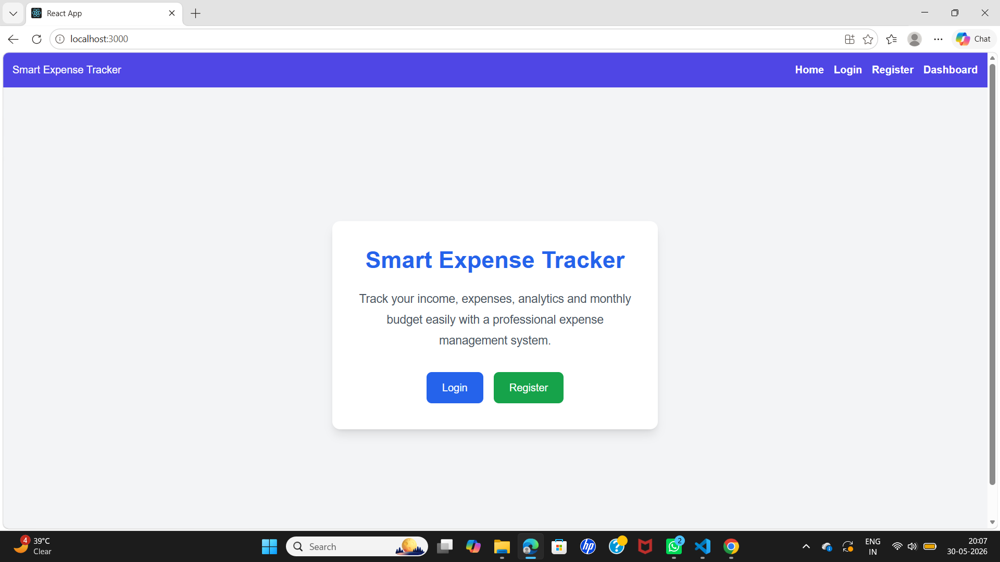
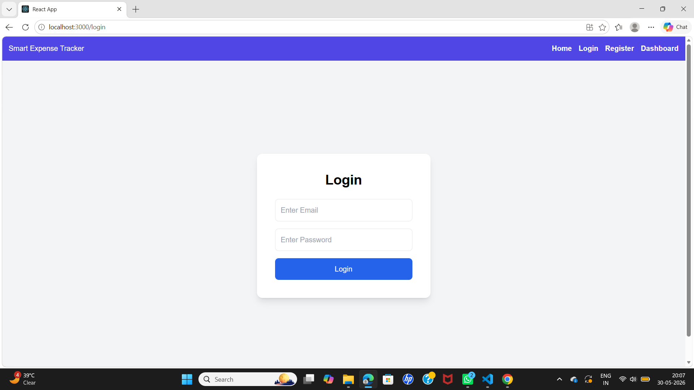
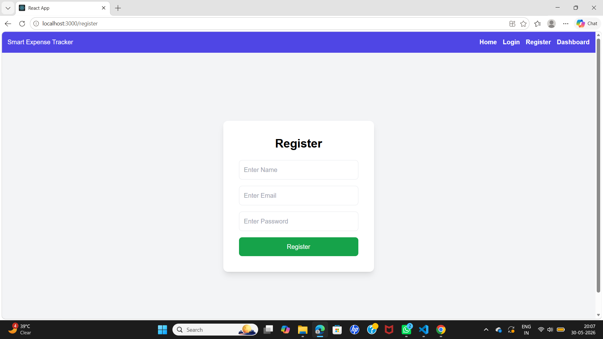
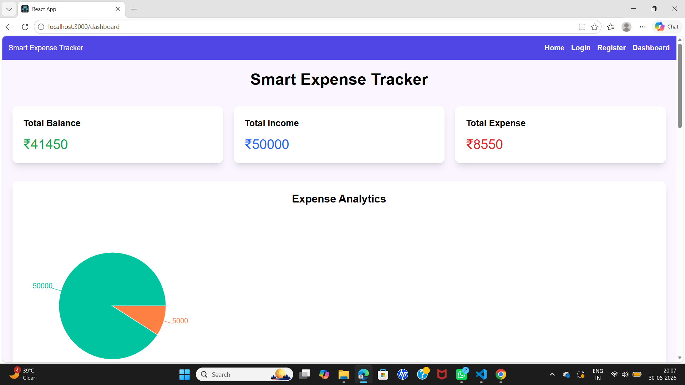
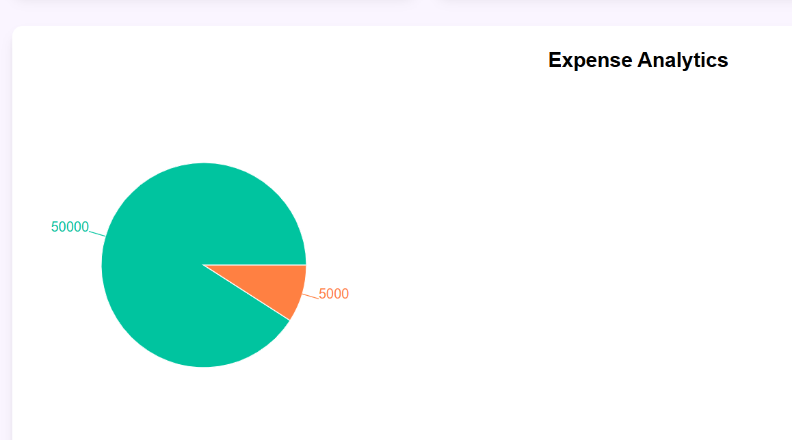
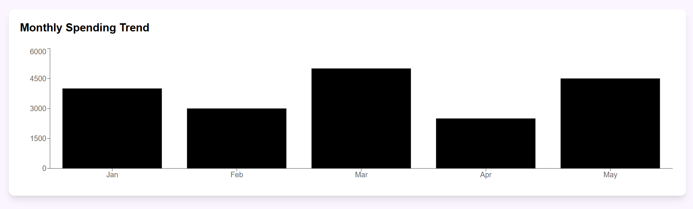
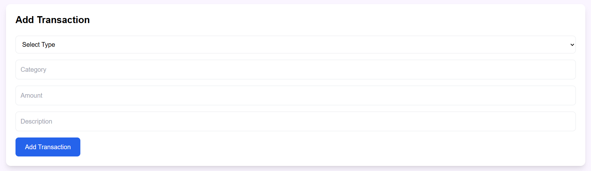
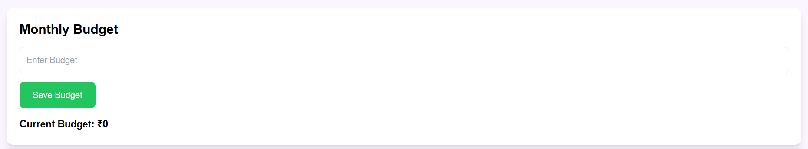
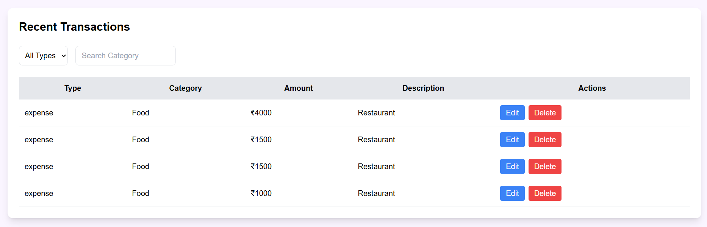

## Smart Expense Tracker Web Application

## 📌 Project Overview

Smart Expense Tracker is a full-stack personal finance management web application developed using React.js, Node.js, Express.js, and MongoDB. The application helps users manage their income, expenses, monthly budgets, and financial analytics through an interactive dashboard.

The system allows users to:

- Register and login securely
- Add income and expense transactions
- Track monthly spending
- Set monthly budgets
- Analyze expenses using charts
- View transaction history
- Receive budget limit alerts

This project demonstrates full-stack web development concepts including frontend UI development, backend API creation, database integration, authentication, CRUD operations, and data visualization.

---

## 🎯 Problem Statement

Managing personal finances manually can be difficult and inefficient. Many users struggle to:

- Track daily expenses
- Monitor monthly spending
- Maintain budgets
- Analyze financial habits

This project solves these problems by providing a centralized finance tracking system with real-time analytics and budget monitoring.

---

## ✨ Features

# 👤 Authentication System

- User Registration
- User Login
- JWT Authentication

# 💰 Expense Management

- Add income transactions
- Add expense transactions
- Transaction categories
- Edit transactions
- Delete transactions
- Transaction history

# 📊 Dashboard Analytics

- Total Income
- Total Expense
- Total Balance
- Expense Analytics Charts
- Monthly Spending Trend

# 📁 Budget Module

- Set Monthly Budget
- Budget Tracking
- Budget Limit Alert

# 🔎 Additional Features

- Category Filter
- Responsive UI
- Professional Dashboard
- Real-time Data Updates

---

## 🛠 Tech Stack

# Frontend

- React.js
- Tailwind CSS
- Axios
- Recharts / Chart.js

# Backend

- Node.js
- Express.js

# Database

- MongoDB
- Mongoose

# Authentication

- JWT (JSON Web Token)

---

## 🏗 Project Architecture

Frontend (React.js)
↓
API Requests (Axios)
↓
Backend Server (Node.js + Express.js)
↓
MongoDB Database

---

```

## 📂 Folder Structure

Smart-Expense-Tracker/
│
├── frontend/
│   ├── src/
│   ├── components/
│   ├── pages/
│   ├── services/
│   └── package.json
│
├── backend/
│   ├── models/
│   ├── routes/
│   ├── controllers/
│   ├── middleware/
│   ├── config/
│   └── package.json
│
├── docs/
│   ├── screenshots/
│   └── demo-video/
│
├── README.md
└── .gitignore


```

---

## 🔗 API Endpoints

# Authentication Routes

Method| Endpoint| Description
POST| /api/auth/register| Register User
POST| /api/auth/login| Login User

---

# Transaction Routes

Method| Endpoint| Description
GET| /api/transactions| Get All Transactions
POST| /api/transactions| Add Transaction
PUT| /api/transactions/:id| Update Transaction
DELETE| /api/transactions/:id| Delete Transaction

---

# Budget Routes

Method| Endpoint| Description
POST| /api/budget| Save Budget
GET| /api/budget| Get Budget

---

# Dashboard Routes

Method| Endpoint| Description
GET| /api/dashboard| Dashboard Summary

---

## ▶️ How To Run The Project

1️⃣ Clone Repository

git clone <https://github.com/keshkarsaloni-lab/Smart-Expense-Tracker.git>

---

2️⃣ Backend Setup

cd backend
npm install
npm run dev

Backend runs on:

http://localhost:5000

---

3️⃣ Frontend Setup

cd frontend
npm install
npm start

Frontend runs on:

http://localhost:3000

---

# ⚙️ Environment Variables

Create ".env" file inside backend folder:

MONGO_URI=your_mongodb_connection_string
JWT_SECRET=your_secret_key

---

# 🗄 MongoDB Setup

1. Create MongoDB Atlas account
2. Create cluster
3. Get connection string
4. Paste connection string inside ".env"
5. Start backend server

---

## 📸 Project Screenshots

### Home Page


### Login Page


### Register Page


### Dashboard Summary


### Expense Analytics


### Monthly Spending Trend


### Add Transaction


### Monthly Budget


### Recent Transactions


---

## 🎥 Demo Video

[Watch Demo Video](docs/Smart_Expense_Tracker_Demo.mp4)

---

## 📚 Learning Outcomes

Through this project, the following concepts were learned:

- Full-stack web development
- REST API development
- React component architecture
- MongoDB database integration
- Authentication using JWT
- CRUD operations
- State management
- API integration using Axios
- Data visualization using charts
- Responsive UI development
- Real-world project structuring
- GitHub project management

---

## 🚀 Future Improvements

- Dark Mode
- Export Reports PDF
- User Profile Management
- Multi-user Dashboard
- AI-based Expense Prediction
- Mobile App Version

---

## 👩‍💻 Developed By

Saloni Keshkar

B.Tech Engineering Student

---

## ⭐ Conclusion

Smart Expense Tracker is a practical and beginner-friendly finance management application that demonstrates modern full-stack web development concepts with real-world functionality.